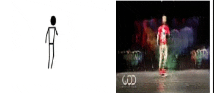
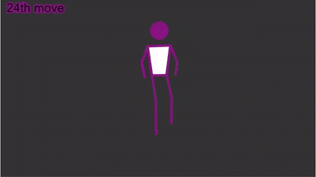

# AI Dancer

[](https://github.com/SuyashSonawane/AI-Dancer)
[](https://github.com/SuyashSonawane/AI-Dancer)
[](https://github.com/SuyashSonawane/AI-Dancer)

A Long Short Term Memory Neural Network and Style GAN based Dancer that can generate new dance steps.

Explanation
[video](https://www.youtube.com/watch?v=kDGQDVmToVI)

## Final GAN Output



## Intermediate LSTM Output



## Table of Contents

- [AI Dancer](#ai-dancer)
  - [Final GAN Output](#final-gan-output)
  - [Intermediate LSTM Output](#intermediate-lstm-output)
  - [Table of Contents](#table-of-contents)
  - [Getting Started](#getting-started)
- [Dancer with LSTM](#dancer-with-lstm)
  - [Data Format](#data-format)
  - [Adding Training Data](#adding-training-data)
  - [Generating new Dance Moves](#generating-new-dance-moves)
- [Generating new Images with GAN](#generating-new-images-with-gan)
  - [Data Format](#data-format-1)
  - [Training GAN](#training-gan)
  - [Generating Images](#generating-images)
  - [Generating Video](#generating-video)
- [Extras](#extras)
  - [Future Improvements](#future-improvements)
  - [Contributing](#contributing)
  - [Author](#author)
  - [License](#license)
  - [Acknowledgments](#acknowledgments)

## Getting Started

These instructions will get you a copy of the project up and running on your local machine for development.

What things you need to install the software and how to install them

```
tensorflow==2.1.0
numpy==1.18.4
pandas==1.0.3
joblib==0.16.0
```

# Dancer with LSTM

A step by step series of examples that tell you how to get a trained model

## Data Format

The rows of the csv file should contain 26 cols, as the posnet outputs 13 body points along with x , y co-ordinates. [exmaple.csv](data\dance_download1.csv)

```
22.955015543143883,72.49466019717806,27.46597426862512,76.79345393785027,18.440016123751217,76.96221626385844,27.696941055981966,85.40758682459185,17.291410152442737,83.79467011985258,25.599847328825536,89.44064099049706,19.33106420565302,88.3909251787509,25.5050841214364,91.59095023528874,19.353783085099902,91.11421950193409,24.34983123719808,103.17374728018777,18.205918577911792,103.16785845840187,22.1979048879523,112.20190911543995,17.676485117415936,112.5701994124444
```

Suggested order

```
"nose",
"leftShoulder",
"rightShoulder",
"leftElbow",
"rightElbow",
"leftWrist",
"rightWrist",
"leftHip",
"rightHip",
"leftKnee",
"rightKnee",
"leftAnkle",
"rightAnkle",
```

CSV examples are already included in the `data/` directory.

## Adding Training Data

copy your csv files in the `data/` directory, if more than one file is to be added name them `{filename}%d.csv`.

check [train.py](train.py)

```
> python train.py
```

## Generating new Dance Moves

When the above steps are done trained models weight will be saved to the `weights/` directory, select the weights file with highest accuracy.

check [generate.py](generate.py)

```
> python generate.py {path to weightsfile} {num of steps to generate}
```

New csv file will be generated `new_moves.csv` with rows containing position points

# Generating new Images with GAN

## Data Format

In the next steps I made a visualizer in `P5.js` to display the csv data in the form of stick figure, then I saved those images as target images for the GAN, the samples are shared in `target/` directory.

SAMPLE


In the `images/` directory there are images which contain the stick figure as well as the real image which was used to generate the training data

SAMPLE


## Training GAN

Copy your training images in the `images/` folder, and run the command

```
!# 10 epochs
> python gan_train.py
```

the checkpoints will be saved in the `training_checkpoints/` directory after every 5 epochs

## Generating Images

Copy your target images in the `target/` folder, and run the command

```
> python gan_generate.py
```

the images will be generated and saved in `new_images/` directory.

## Generating Video

Now we have our new images generated in `new_images/` directory we can convert them into a video using ffmpeg

```
> ffmpeg -r 1/5 -i new_images/fig%d.jpg -c:v libx264 -vf  "fps=25 ,pad=ceil(iw/2)*2:ceil(ih/2)*2"  -pix_fmt yuv420p out.mp4
```

this will create `out.mp4` file with the images as a video file.

# Extras

## Future Improvements

1. Improve the GAN and the Neural Network to generate more realistic images
2. Deploying project to Web, to generate new moves on the go.

## Contributing

This is a opensource project, if you want to contribute feel free to create a pull request.

## Author

**Suyash Sonawane** - [Github](https://github.com/suyashsonawane) | [LinkedIn](https://www.linkedin.com/in/suyash-sonawane-44661417b/)

For any feedback and suggestions mail me at [Suyash Sonawane](mailto:suyashsonawane005@gmail.com)

## License

This project is licensed under the MIT License - see the [LICENSE.md](LICENSE.md) file for details

## Acknowledgments

- YouTube video by @carykh
